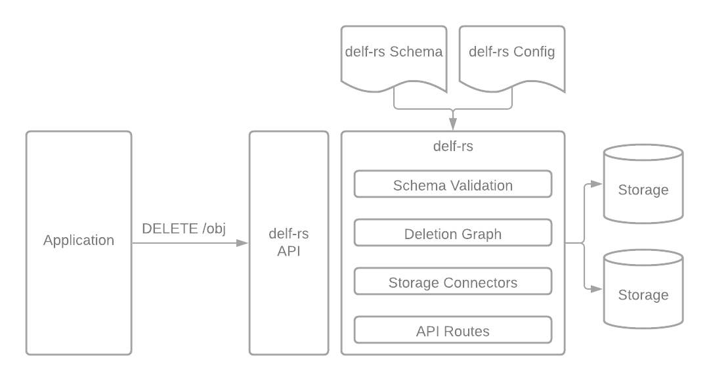

# delf-rs

A [DelF](https://cs.brown.edu/courses/csci2390/2020/readings/delf.pdf) inspired deletion framework in Rust.

The original DelF is a deletion framework created at FaceBook, which aims to robustly delete all related data from its data stores as defined by the `deletion` definitions added to FaceBook's existing data definition language (DDL). It includes logging, data recovery in case of unintended deletion, asynchronous execution, dynamic analysis, and retries deletions until complete in addition to the features this implementation includes.

This DelF aims to be a lighter weight deletion framework, without the need for FaceBook's infrastructure stack. The following features are included in the scope of this work.




### REST API

> **:warning: STATUS: Mostly Complete**  
> - [x] Set up rockets routes
> - [x] Package crate
> - [ ] Tests
> - [x] Documentation

The primary interaction point of delf-rs is a rest API with `DELETE` routes that the main application can make requests to. This can be either an object with an ID, or an edge with its to and from IDs.

### Schema Validation

> **:warning: STATUS: Mostly Complete**  
> - [x] Read in YAML to Graph
> - [ ] Error handling for invalid ddl yaml (currently just panics)
> - [x] Validate schema against DB
> - [x] Static Analysis (stretch goal)
> - [ ] Tests
> - [x] Documentation

Inspired by FaceBook's DDL, this project has created a smaller version of the DDL which includes on the fields needed for deletions to be correctly done. It consists of `object_types`, which have a list of `edge_types` as one of the attributes of the object. This schema is a yaml file, which is loaded into the delf-rs runtime to create the graph. It can also be validated against the configured databases to ensure all of the objects/edges exist as described. Static analysis can also be run on the schema to find common errors.

### Deletion Graph

> **:warning: STATUS: Mostly Complete**  
> - [x] Create data structures / enums for deletion types
> - [x] Implement algorithm for traversing the graph
>   - [x] Implement all edge deletion types (3/3 complete)
>   - [x] Implement all object deletion types (6/6 complete)
> - [x] Adjust algorithm to dispatch deletions to database
> - [ ] Tests
> - [x] Documentation

The deletion graph is the core data structure backing delf. It contains the relationships between entities as well as how they are connected by edges and how they many be deleted.  The same deletion types have been used as in the original DelF.

### Storage Connectors

> **:warning: STATUS: Partially Complete**  
> - [x] Create trait for DelfStorage
> - [ ] Create plugins for databases:
>   - [x] mysql (using diesel, hope to be able to easily also support postgres and sqlite)
>   - [ ] mongo
>   - [ ] neo4j
> - [ ] Tests
> - [x] Documentation

delf-rs can connect to a variety of databases and can delete objects/edges across systems. Each database is implemented with a common api, so they are pluggable and can be extended to any database as long as there is a way to delete objects and edges as defined in the ddl. Additionally the database connectors are used to validate the yaml schema reflects what is implemented on the system.

### CLI

> **:warning: STATUS: Mostly complete**  
> - [x] Set up cli methods
>   - [x] Validate
>   - [x] Run
> - [ ] package
> - [ ] Tests
> - [x] Documentation

A cli is useful for running the validation of the schema as well as the static analysis. These can both be run without the API, but do require the other components of delf-rs.

### Example

> **:warning: STATUS: Mostly complete**  
> - [x] Dockerize application
> - [x] Load test data
> - [x] Create delf schema (partially complete)
> - [x] Create delf config (not secure, but working)
> - [ ] Replace deletion in app with delf (stretch)

HotCRP is open source conference management software. It is being used as an example to run delf-rs on.  The storage used is a mysql database, which has been dockerized to make testing/reproducibility easier for delf-rs.

## Running the code

### Prerequisites

* Rust
* Docker

### Storage

Docker container with fake data can be found at https://github.com/mcmcgrath13/hotcrp/.

```
docker-compose up -d
```

### Delf

To run the rust code on the HotCRP schema, run the command below.

```
cargo run --example hotcrp
```
